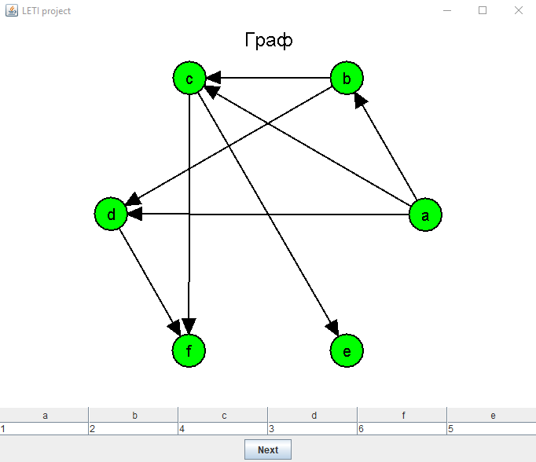
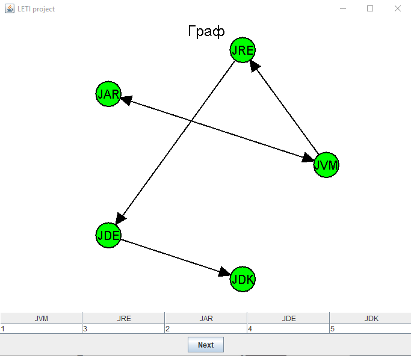
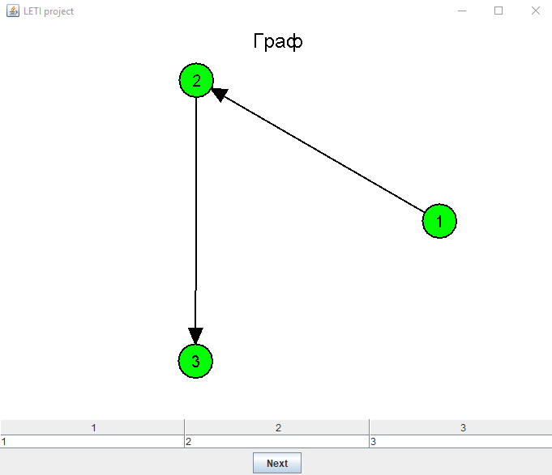

# Летняя учебная практика на Java

## Топологическая сортировка графа

### Входные данные

Исходные данные – ориентированный невзвешенный граф, представленный списком инцидентности. Ввод графа может осуществляться следующим образом:

- Ввод графа из __текстового файла__, в котором граф задается в виде списка инцидентности

#### Пример

```
    a b c d
    b d c
    c e f
    d f
    f
    e
```

#### Результат

- Создание __произвольного графа__ через интерфейс: выбор количества вершин и ребер, расположение, ориентированность ребер и имена которых, программа создает произвольно

### Выходные данные

Визуализированный исходный граф, пошаговая визуализация алгоритма топологической сортировки, таблица нумерованных вершин (в топологическом порядке)

### Примеры работы программы

1) 

2)  

3) 